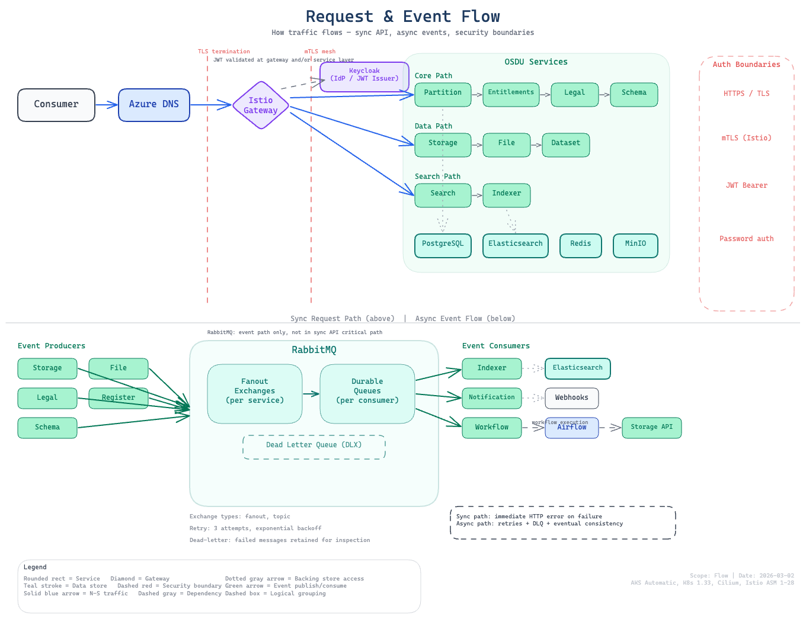

# Request & Event Flow

This page documents how traffic flows through the cimpl-azd platform, from external requests entering the cluster to internal service-to-service communication and async event processing.



## External Traffic Path

External requests enter the cluster through Istio's ingress gateway:

```
Internet
  │
  ▼
Azure Load Balancer (External IP)
  │
  ▼
Istio Ingress Gateway (aks-istio-ingress namespace)
  │
  ▼
Gateway API (HTTPRoute rules)
  │
  ├──► Kibana Service (platform namespace)
  └──► OSDU Services (osdu namespace, via mTLS)
          │
          ▼
       cert-manager TLS termination at gateway
```

### DNS Resolution

Each exposed service gets a hostname derived from the ingress prefix:

```
<prefix>-kibana.<dns_zone_name>     → Kibana
<prefix>-<service>.<dns_zone_name>  → OSDU service (if exposed)
```

The ingress prefix (`CIMPL_INGRESS_PREFIX`) is auto-generated during pre-provision if not set. DNS records are created either manually or via ExternalDNS (if enabled).

### TLS Certificates

cert-manager provisions Let's Encrypt certificates for each HTTPRoute hostname. Certificates are stored as Kubernetes Secrets and referenced by the Gateway resource. The HTTP-01 challenge solver uses the Istio Gateway for validation.

---

## Internal Service Communication

### OSDU Service-to-Service (mTLS)

All OSDU services in the `osdu` namespace communicate over Istio's mTLS mesh:

```
OSDU Service A
  │
  ▼ (Istio sidecar encrypts)
Envoy Proxy → mTLS → Envoy Proxy
                        │
                        ▼
                   OSDU Service B
```

- **mTLS mode:** STRICT (enforced by `PeerAuthentication` in the `osdu` namespace)
- **Service discovery:** Kubernetes DNS (e.g., `partition.osdu.svc.cluster.local:80`)
- **K8s Service port:** 80 (targetPort 8080 on the pod)

### Middleware Access (Cross-Namespace)

OSDU services in the `osdu` namespace reach middleware in the `platform` namespace via standard Kubernetes DNS:

| Middleware | Endpoint | Port |
|-----------|----------|------|
| PostgreSQL (read-write) | `postgresql-rw.platform.svc.cluster.local` | 5432 |
| PostgreSQL (read-only) | `postgresql-ro.platform.svc.cluster.local` | 5432 |
| Elasticsearch | `elasticsearch-es-http.platform.svc.cluster.local` | 9200 |
| Redis | `redis-master.platform.svc.cluster.local` | 6379 |
| RabbitMQ | `rabbitmq.platform.svc.cluster.local` | 5672 |
| MinIO | `minio.platform.svc.cluster.local` | 9000 |
| Keycloak | `keycloak.platform.svc.cluster.local` | 8080 |

!!! note
    Both the `platform` and `osdu` namespaces have Istio sidecar injection enabled with STRICT mTLS. Cross-namespace calls between them stay within the mesh. A few pods in the `platform` namespace (e.g., RabbitMQ) opt out of sidecar injection at the pod level due to `NET_ADMIN` requirements; calls to these pods use application-layer security (password auth).

---

## Authentication Flow

### User Authentication (Azure AD → Kubernetes)

```
User → az login → Azure AD → kubelogin → Kubernetes API
```

### OSDU Service Authentication (Keycloak)

```
Client → Keycloak (osdu realm) → JWT token
  │
  ▼
OSDU Service → validates JWT → authorized request
```

The `datafier` client in the Keycloak `osdu` realm is a confidential service account used by bootstrap containers to provision initial data (entitlements groups, partition registration).

---

## Async Event Flow

### RabbitMQ Messaging

OSDU services use RabbitMQ for asynchronous event processing:

```
Producer Service
  │
  ▼
RabbitMQ Exchange
  │
  ├──► Queue A → Consumer Service A
  └──► Queue B → Consumer Service B
```

**Key exchanges and patterns:**

- **Storage → Indexer:** When records are created/updated, Storage publishes events that Indexer consumes to update Elasticsearch indices
- **Notification:** Events published to notification exchange for downstream consumers
- **Workflow → Airflow:** Workflow service triggers DAG runs via message queue

### Connection Details

```
Host:     rabbitmq.platform.svc.cluster.local
Port:     5672
Username: from rabbitmq-secret
Password: from rabbitmq-secret
```

---

## Data Storage Patterns

### PostgreSQL (Structured Data)

Each OSDU service stores structured data in its own database within the shared CNPG cluster:

```
Service → JDBC → postgresql-rw.platform:5432/<service_db>
```

The OSM (Object Storage Model) pattern uses:

- `id text`: unique record identifier
- `pk bigint IDENTITY`: auto-incrementing primary key
- `data jsonb NOT NULL`: JSON document storage
- GIN index on `data` column for JSON path queries

### Elasticsearch (Search & Analytics)

Indexer maintains Elasticsearch indices for full-text search:

```
Storage event → Indexer → Elasticsearch indices
                              │
Search query → Search ────────┘
```

### MinIO (Object Storage)

File and Dataset services store binary objects in MinIO:

```
File Service → S3 API → minio.platform:9000 → bucket/object
```

---

## Deployment-Time Data Flow

### Bootstrap Sequence

After services are deployed, bootstrap containers seed initial data:

```
1. Partition bootstrap
   └── Registers "osdu" data partition with all middleware endpoints

2. Entitlements bootstrap
   ├── Acquires token from Keycloak (datafier client)
   └── Provisions tenant entitlements groups via Entitlements API

3. Per-service bootstrap (if applicable)
   └── Seeds service-specific reference data
```

Bootstrap containers run as Kubernetes Deployments (`type=bootstrap`) that call the service API. They require the target service to be healthy AND the database tables to exist.
