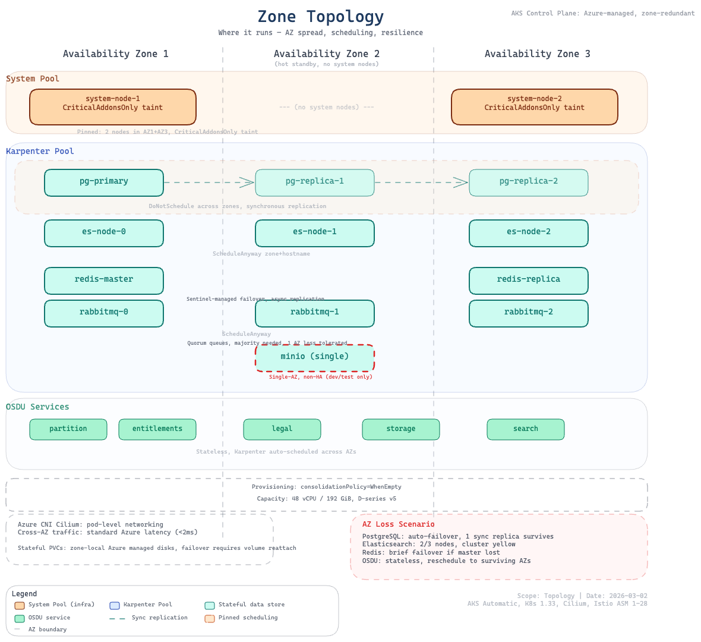

# Infrastructure Design

The infrastructure layer (`infra/`) provisions the foundational AKS cluster and Azure resources. This is Layer 1 of the [three-layer deployment model](overview.md).

## AKS Automatic

### Why AKS Automatic?

AKS Automatic provides a managed Kubernetes experience with built-in best practices (see [ADR-0001](../decisions/0001-use-aks-automatic-as-deployment-target.md)):

- **Simplified operations** — Auto-scaling, auto-upgrade, auto-repair
- **Built-in best practices** — Network policy, pod security, cost optimization
- **Integrated Istio** — Managed service mesh without manual installation
- **Deployment Safeguards** — Gatekeeper policies for compliance

```hcl
# AKS Automatic with Istio
sku = { name = "Automatic", tier = "Standard" }
service_mesh_profile = { mode = "Istio" }
```

### Terraform Resources

```
azurerm_resource_group.main
module.aks (Azure Verified Module)
azurerm_role_assignment.aks_cluster_admin
azurerm_resource_policy_exemption.cnpg_probe_exemption
```

## Zone Topology



The cluster spreads workloads across Azure availability zones for high availability. The system node pool pins to configurable zones, while the platform node pool (Karpenter) dynamically selects from available zones.

## Node Pools

| Pool | Purpose | VM Size | Count | Taints | Managed By |
|------|---------|---------|-------|--------|------------|
| **System** | Critical system components | `var.system_pool_vm_size` (default: Standard_D4lds_v5) | 2 | CriticalAddonsOnly | AKS (VMSS) |
| **Default** | General workloads (MinIO, Airflow task pods) | Auto-provisioned | Auto | None | NAP (Karpenter) |
| **Platform** | Middleware + OSDU services | D-series (4-8 vCPU) | Auto | workload=platform:NoSchedule | NAP (Karpenter) |

**System pool variables:**

- `system_pool_vm_size` — VM SKU for system nodes (default: `Standard_D4lds_v5`)
- `system_pool_availability_zones` — Zones for system nodes (default: `["1", "2", "3"]`)

### Why Karpenter (NAP) for Platform Workloads?

The platform node pool uses AKS Node Auto-Provisioning (NAP), powered by Karpenter, instead of a traditional VMSS-based agent pool (see [ADR-0004](../decisions/0004-karpenter-for-stateful-workloads.md)):

1. **Eliminates `OverconstrainedZonalAllocationRequest` failures** — Karpenter selects from multiple D-series VM SKUs per zone
2. **Dynamic SKU selection** — 4-8 vCPU VMs with premium storage support, best available option per zone
3. **Automatic scaling** — Nodes provisioned on-demand and consolidated when empty

Workloads target these nodes via `agentpool: platform` nodeSelector and `workload=platform:NoSchedule` toleration. The Karpenter `NodePool` and `AKSNodeClass` CRDs are deployed in `software/stack/platform.tf`.

## Network Architecture

### Network Configuration

```
Network Plugin:      Azure CNI Overlay
Network Dataplane:   Cilium
Outbound Type:       Managed NAT Gateway
Service CIDR:        10.0.0.0/16
DNS Service IP:      10.0.0.10
```

### Network Security

- **Azure CNI Overlay** — Pod IPs in overlay network, no VNet subnet exhaustion
- **Cilium** — eBPF-based network policy enforcement
- **Managed NAT Gateway** — Outbound traffic via dedicated NAT
- **Istio mTLS** — STRICT mode in `osdu` namespace for east-west traffic

## Istio Service Mesh

AKS-managed Istio (revision `asm-1-28`) provides:

- Automatic sidecar injection via namespace label on `osdu` namespace
- Traffic management via Gateway API
- External ingress gateway
- mTLS between OSDU services

```yaml
# Istio injection enabled on OSDU namespace
metadata:
  labels:
    istio-injection: enabled
```

Both the `platform` and `osdu` namespaces have Istio injection enabled with STRICT mTLS. Specific pods that require `NET_ADMIN` capabilities (e.g., RabbitMQ) opt out at the pod level via `sidecar.istio.io/inject: "false"`. See [ADR-0008](../decisions/0008-selective-istio-sidecar-injection.md) for the selective injection strategy.

## Azure RBAC

### Kubernetes Authentication

- Local accounts disabled — Azure AD authentication required
- Azure RBAC roles:
    - `Azure Kubernetes Service RBAC Cluster Admin`
    - `Azure Kubernetes Service RBAC Admin`
    - `Azure Kubernetes Service RBAC Reader`

### Workload Identity

Workload Identity enables pods to authenticate to Azure services without storing credentials (see [ADR-0009](../decisions/0009-workload-identity-for-dns-management.md)):

```
Pod → Service Account → Federated Credential → Azure AD → Azure Resource
```

Used by ExternalDNS for cross-subscription DNS zone management.

## Resource Naming and Tagging

### Naming Convention

All resources follow the pattern: `<prefix>-<project>-<environment>`

| Resource | Pattern | Example |
|----------|---------|---------|
| Resource Group | `rg-cimpl-<env>` | rg-cimpl-dev |
| AKS Cluster | `cimpl-<env>` | cimpl-dev |
| Namespaces | `platform`, `osdu` (with optional stack suffix) | platform-blue, osdu-blue |

### Tagging Strategy

All Azure resources include:

| Tag | Value |
|-----|-------|
| `azd-env-name` | Environment name |
| `project` | cimpl |
| `Contact` | Owner email address |
