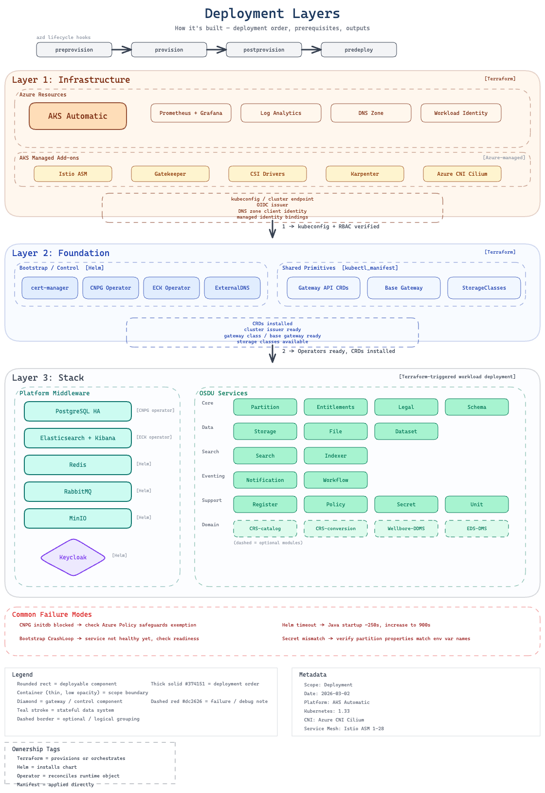

# Architecture Overview

cimpl-azd deploys a complete OSDU platform on Azure Kubernetes Service (AKS) Automatic using a layered Terraform architecture. This page provides the high-level view; dedicated sub-pages cover each layer in detail.

Use this page to understand how the repository is organized, how it maps to the deployment lifecycle, and why each layer exists.

## Deployment Layers



The deployment is split into three Terraform states, each with its own lifecycle:

| Layer | Directory | Deployed By | Purpose |
|-------|-----------|-------------|---------|
| **1. Cluster Infrastructure** | `infra/` | `azd provision` | AKS cluster, system node pool, RBAC, policy exemptions |
| **2. Foundation** | `software/foundation/` | `post-provision` hook | Cluster-wide singletons: cert-manager, ECK operator, CNPG operator, ExternalDNS, Gateway API CRDs, StorageClasses |
| **3. Software Stack** | `software/stack/` | `pre-deploy` hook | Middleware instances (ES, PG, Redis, RabbitMQ, etc.) + all OSDU services |

**Why three layers?** The AKS cluster must exist before any Kubernetes resources can be deployed. Foundation components (operators, CRDs, StorageClasses) are cluster-wide singletons that all stacks share. The software stack deploys middleware instances and OSDU services that can vary per stack.

!!! note "Conceptual vs Terraform layers"
    Conceptually the architecture has three tiers: **infrastructure**, **platform middleware**, and **OSDU services**. In practice, middleware and OSDU services share a single Terraform state (`software/stack/`) because OSDU services have explicit `depends_on` relationships with middleware modules. The foundation layer was extracted to hold cluster-wide singletons that are independent of any individual stack.

!!! note "Evolution"
    The original design used two Terraform states (see [ADR-0006](../decisions/0006-two-layer-terraform-state.md)); the foundation layer was extracted later to improve lifecycle isolation.

## Namespace Architecture

Resources are organized into namespaces with optional stack-id suffix for multi-stack support (see [ADR-0017](../decisions/0017-consolidated-namespace-architecture.md)):

| Namespace | Contents | Istio Injection |
|-----------|----------|-----------------|
| `foundation` | Cluster-wide operators (cert-manager, ECK, CNPG), Gateway CRDs, StorageClasses | N/A (operators) |
| `platform` | Middleware instances: Elasticsearch, PostgreSQL, Redis, RabbitMQ, MinIO, Keycloak, Airflow | Enabled (STRICT mTLS, with pod-level opt-outs) |
| `osdu` | OSDU common resources + all OSDU services | Enabled (STRICT mTLS) |

For named stacks (e.g., `STACK_NAME=blue`), namespaces become `platform-blue` and `osdu-blue`. The `foundation` namespace is shared across all stacks.

## Three-Phase Deployment Flow

```
azd up
  │
  ├── pre-provision     → Validate prerequisites, auto-generate credentials
  ├── provision         → Create AKS cluster (Layer 1: infra/)
  ├── post-provision    → Configure safeguards [GATE]
  │                       + Deploy foundation (Layer 2: software/foundation/)
  │
  └── pre-deploy        → Deploy software stack (Layer 3: software/stack/)
        ├── Karpenter NodePool + platform namespace
        ├── Middleware in dependency order
        ├── OSDU common resources
        └── OSDU services with dependency chains
```

**Why a gate?** Azure Policy/Gatekeeper is eventually consistent. Fresh clusters have a window where policies aren't fully reconciled. The post-provision hook makes safeguards readiness an explicit gate before deploying any workloads (see [ADR-0005](../decisions/0005-two-phase-deployment-gate.md)).

## Node Pool Strategy

| Pool | Purpose | VM Size | Managed By |
|------|---------|---------|------------|
| **System** | Critical system components (Istio, CoreDNS, Gateway) | `Standard_D4lds_v5` (configurable) | AKS (VMSS) |
| **Default** | General workloads (MinIO, Airflow task pods) | Auto-provisioned | NAP (Karpenter) |
| **Platform** | Middleware + OSDU services | D-series 4-8 vCPU | NAP (Karpenter) |

The platform node pool uses Karpenter (NAP) with dynamic SKU selection to avoid `OverconstrainedZonalAllocationRequest` failures (see [ADR-0004](../decisions/0004-karpenter-for-stateful-workloads.md)).

## Project Structure

The repository layout mirrors the deployment layers. Each directory maps to a Terraform state with its own lifecycle.

```
cimpl-azd/
├── azure.yaml                       # azd configuration
├── infra/                           # Layer 1: Cluster Infrastructure
│   ├── main.tf                      # Resource group
│   ├── aks.tf                       # AKS Automatic cluster
│   ├── variables.tf                 # Input variables
│   └── outputs.tf                   # Outputs for azd
├── software/
│   ├── foundation/                  # Layer 2: Foundation (cluster-wide singletons)
│   │   ├── main.tf                  # Foundation namespace, Gateway CRDs, StorageClasses
│   │   ├── charts/
│   │   │   ├── cert-manager/        # cert-manager + ClusterIssuers
│   │   │   ├── elastic/             # ECK operator
│   │   │   ├── cnpg/                # CNPG operator
│   │   │   └── external-dns/        # ExternalDNS
│   │   └── variables.tf
│   └── stack/                       # Layer 3: Software Stack
│       ├── locals.tf                # Naming derivation, FQDNs
│       ├── platform.tf              # Platform namespace, Istio mTLS, Karpenter
│       ├── middleware.tf            # Middleware module calls
│       ├── osdu-common.tf           # OSDU common resources
│       ├── osdu-services-core.tf    # Core OSDU services (13 + Workflow)
│       ├── osdu-services-reference.tf  # Reference systems (3)
│       ├── osdu-services-domain.tf  # Domain services (3)
│       ├── variables-flags-platform.tf       # Platform middleware flags
│       ├── variables-flags-osdu-core.tf     # OSDU core service flags + group switch
│       ├── variables-flags-osdu-reference.tf # OSDU reference service flags + group switch
│       ├── variables-flags-osdu-domain.tf   # OSDU domain service flags + group switch
│       ├── variables-infra.tf       # Infrastructure variables
│       ├── variables-credentials.tf # Sensitive credentials
│       ├── variables-osdu.tf        # OSDU config
│       ├── modules/                 # Child Terraform modules
│       │   ├── elastic/             # Elasticsearch + Kibana CRs + bootstrap
│       │   ├── postgresql/          # PostgreSQL cluster + DDL bootstrap
│       │   ├── redis/               # Redis cache
│       │   ├── rabbitmq/            # RabbitMQ (raw manifests)
│       │   ├── minio/               # MinIO object storage
│       │   ├── keycloak/            # Keycloak (raw manifests)
│       │   ├── airflow/             # Apache Airflow
│       │   ├── gateway/             # HTTPRoutes + TLS certificates
│       │   ├── osdu-common/         # OSDU namespace + secrets
│       │   └── osdu-service/        # Reusable OSDU Helm wrapper
│       └── kustomize/               # Postrender patches per service
├── scripts/
│   ├── pre-provision.ps1            # Prerequisite validation
│   ├── post-provision.ps1           # Safeguards gate + foundation deploy
│   └── pre-deploy.ps1               # Stack Terraform apply
└── docs/                            # Documentation (this site)
```

## External Access

When DNS and ingress are configured, the gateway module exposes multiple endpoints externally via HTTPS with automatic TLS certificates (cert-manager + Let's Encrypt):

| Endpoint | Hostname | Purpose |
|----------|----------|---------|
| **OSDU API** | `{prefix}.{zone}` | Path-based routing to all enabled OSDU services (e.g., `/api/partition/`, `/api/storage/`) |
| **Kibana** | `{prefix}-kibana.{zone}` | Elasticsearch/Kibana dashboard |
| **Keycloak** | `{prefix}-keycloak.{zone}` | Identity provider admin console and token endpoint |
| **Airflow** | `{prefix}-airflow.{zone}` | DAG monitoring and task execution UI (optional) |

Each endpoint gets its own Gateway API HTTPS listener, HTTPRoute, TLS Certificate, and cross-namespace ReferenceGrants. Only enabled endpoints are created — see [Feature Flags](../getting-started/feature-flags.md) for ingress flags.

## What's Next

- **[Infrastructure Design](infrastructure.md)**: AKS Automatic configuration, node pools, networking, and Azure RBAC setup
- **[Platform Components](platform.md)**: how middleware (Elasticsearch, PostgreSQL, Redis, etc.) is deployed and configured
- **[Software Patterns](software.md)**: Terraform module patterns, Helm + Kustomize postrender, and feature flags
- **[Request & Event Flow](data-flow.md)**: how traffic routes through the gateway, service mesh, and async messaging
