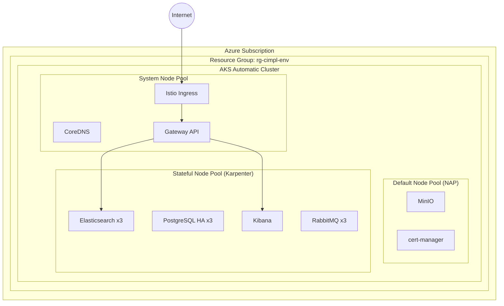

# cimpl-azd

Azure Developer CLI (azd) deployment for CIMPL on AKS Automatic.

## Overview

This project deploys a complete platform stack on Azure Kubernetes Service (AKS) Automatic, including:

- **AKS Automatic** — Managed Kubernetes with auto-scaling and built-in Istio
- **Elasticsearch** — Search and analytics engine (3-node cluster)
- **Kibana** — Elasticsearch visualization
- **PostgreSQL** — Relational database (3-instance HA via CloudNativePG)
- **RabbitMQ** — Async messaging (3-node cluster)
- **MinIO** — S3-compatible object storage
- **cert-manager** — Automatic TLS certificate management
- **Istio Service Mesh** — Traffic management and security (AKS-managed)

## Architecture

## Three-Layer Deployment Model

| Layer | Directory | Purpose |
|-------|-----------|---------|
| **1. Cluster Infrastructure** | `infra/` | AKS cluster, node pools, RBAC, Istio |
| **2. Platform Components** | `platform/` | Helm charts, operators, data stores |
| **3. Services** | `services/` | Application workloads *(future)* |

## Quick Links

- [Prerequisites](getting-started/prerequisites.md) — What you need installed
- [Quick Start](getting-started/quickstart.md) — Deploy in minutes
- [Configuration Reference](getting-started/configuration.md) — Environment variables and specs
- [Architecture](architecture/overview.md) — Detailed component documentation
- [ADR Index](decisions/index.md) — Why we made specific design choices
