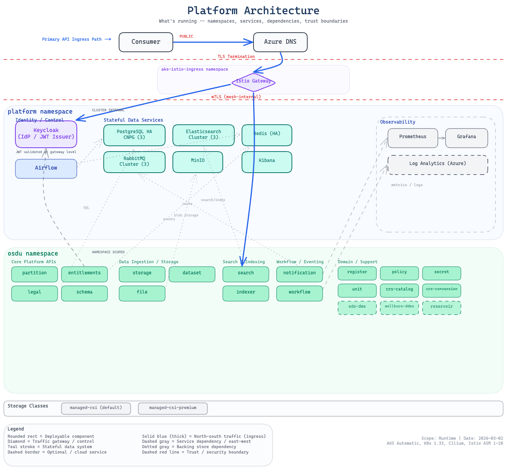

# cimpl-azd

**Azure Developer CLI deployment for CIMPL on AKS Automatic** — a transparent, fully automated platform for running [OSDU](https://osduforum.org/) / [CIMPL](https://community.opengroup.org/osdu/platform) services on Azure Kubernetes Service.

cimpl-azd packages the entire CIMPL stack — infrastructure, middleware, and OSDU services — into a single `azd up` command. Every resource is defined in Terraform, every decision is documented in an ADR, and every component can be toggled with a feature flag.

---

## Why cimpl-azd?

-   :material-eye-outline:{ .lg .middle } **Transparent**

    ---

    100% open-source Terraform — no hidden scripts, no black-box modules. Every resource is auditable and every design decision is captured in [18 ADRs](decisions/index.md).

-   :material-robot-outline:{ .lg .middle } **Automated**

    ---

    Single `azd up` deploys a complete OSDU platform — AKS cluster, foundation operators, middleware stack, and 20+ microservices — with a safeguards gate ensuring policy compliance.

-   :material-tune-variant:{ .lg .middle } **Configurable**

    ---

    30+ [feature flags](getting-started/feature-flags.md) let you deploy exactly what you need. Enable a service with one variable, disable it with another. No fork required.

-   :material-shield-check-outline:{ .lg .middle } **Compliant**

    ---

    Built for [AKS Automatic](https://learn.microsoft.com/azure/aks/intro-aks-automatic) with deployment safeguards, Istio mTLS, pod security standards, and Azure RBAC from day one.

---

## Who is it for?

-   :material-server-network:{ .lg .middle } **Platform Engineers**

    ---

    Deploy and operate an OSDU platform on AKS Automatic. Manage infrastructure, middleware, and services through Terraform with full lifecycle control.

-   :material-cog-outline:{ .lg .middle } **DevOps Engineers**

    ---

    Integrate OSDU deployments into CI/CD pipelines. Use `azd` hooks, feature flags, and multi-environment support for automated testing and promotion workflows.

-   :material-code-braces:{ .lg .middle } **OSDU Developers**

    ---

    Get a local or shared OSDU environment running quickly. Focus on service development while the platform handles infrastructure, networking, and security.

-   :material-cloud-outline:{ .lg .middle } **Cloud Architects**

    ---

    Evaluate the architectural patterns — three-layer deployment, Karpenter node management, AKS safeguards compliance, and Istio service mesh — for your own Azure workloads.

---

## Key Capabilities

| Capability | Description |
|-----------|-------------|
| **Three-layer deployment** | Separate Terraform states for infrastructure, foundation operators, and software stack |
| **AKS Automatic** | Managed Kubernetes with auto-scaling, auto-upgrade, and built-in Istio service mesh |
| **30+ feature flags** | Enable/disable any middleware or OSDU service independently |
| **AKS Deployment Safeguards** | Gatekeeper policies enforced at admission — probes, resource limits, security context |
| **Kustomize postrender** | Automatic compliance patching for all Helm charts via shared postrender framework |
| **Karpenter (NAP)** | Dynamic node provisioning for stateful workloads across availability zones |
| **CloudNativePG** | 3-instance HA PostgreSQL with synchronous replication and per-service databases |
| **Istio mTLS** | STRICT mutual TLS across both platform and OSDU namespaces |
| **Gateway API** | Modern ingress routing with automatic TLS via cert-manager and Let's Encrypt |
| **Multi-environment** | Each `azd env` creates isolated Azure resources — support parallel dev/test/staging |

---

## Quick Links

-   [**Prerequisites**](getting-started/prerequisites.md)

    Tools and Azure permissions you need before deploying.

-   [**Quick Start**](getting-started/quickstart.md)

    Go from zero to a running OSDU platform in minutes.

-   [**Design Overview**](design/overview.md)

    Architecture, component design, and data flow documentation.

-   [**Feature Flags**](getting-started/feature-flags.md)

    Complete reference for all configuration variables and toggles.

-   [**Service Catalog**](services/overview.md)

    All deployed OSDU services with dependencies and configuration.

-   [**ADR Index**](decisions/index.md)

    18 architectural decision records explaining every design choice.

